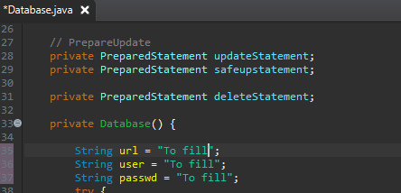
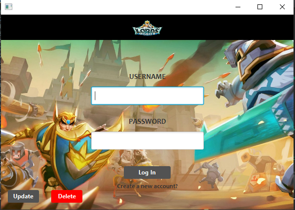

# LORDS MOBILE GUIDE

This software allows Lords mobile's user to select, according to the pieces of gear he possess, the best choice of equipement to fulfill one purpose:
can be the best gear for attacking other players or the best gear to build up his castle,etc...
We choose to make this software to make this selection of gear easier for the player. In the game, you can be easily lost in the choice of equipement since there is so many pieces of gear available.
We also gave the possibility to the user to get the best choice from what he possess which is not possible to do inside the game.

### Requirements:

In order to use this software, you will need to following programms:

- Eclipse 2019-09 R
- MySQL Workbench
- Java JDK 12

### Installation

## Database

Into your workbench, create a new Database.
Then, take the SQL scripts from the file "BDDlords" and execute them in order.

## Eclipse

First, open Eclipse and import the file obtained from the clone URL.

File> Import > Git > Projects from Git> Clone URL

Paste the URL in URL section, inform your Git's account name and password in the Authentication section and press Next.
Choose the place you want it to be in and go Next.

Then Next>Finish.

After this, you need to link your workbench with the program.
In order to do so, open the Database.java and in the method "private Database" change the url, the user and the passwd according to your Workbench access information.

 

Once you are done, you should be able to launch the app.
For that run it as "Java Application" and click on OK.

You should see this launching :

  

### Software Guidance

Once to the first page, you can start creating your account, then go back to the LogIn page.
Enter your information and login.
You will get to the selection of the pieces of gear you got, once your done choosing confirm.
Know that once you select a piece of gear, even if you close application, your selection has been saved in the database so you dont have to select each piece of gear everytime you log in.
After confirming, you will get to the purpose of this software: Get the best gear out of your possessions according to the boost you want.
Choose one of them and Search to make the best Gear appear.
Enjoy :)

 

We used Java languague for our source code, SQL Workbench for the database and Scenebuilder for our FXML.
The images are copyritted and got from the game. (Screenshots and Paint :D)

### Developpers

Alithefirecodeur
Erayana

Contributors: Master Loïc, Pandada King, StackOverFlow Users, Toffer, Yannick, Nadine's cakes.